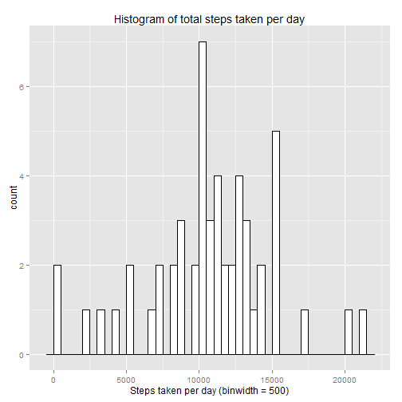
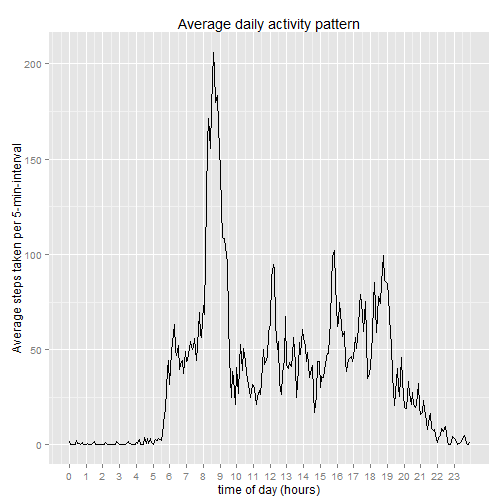
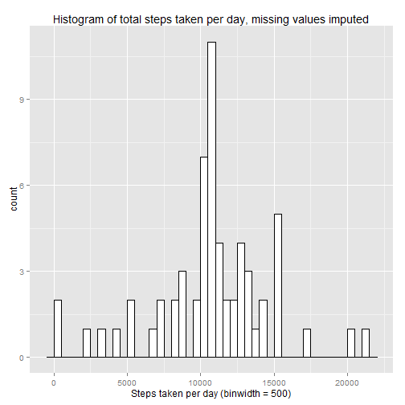
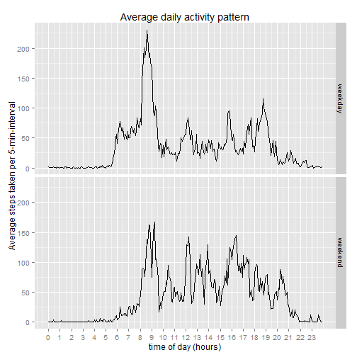

## 1. Loading and preprocessing the data
### Tasks
Show any code that is needed to

1. Load the data (i.e. read.csv())
2. Process/transform the data (if necessary) into a format suitable for your analysis
    
### Implementation
Load libraries, use local zip file, unzip if necessary, load data.  
Use data.table and thus `fread()` instead of data frame and `read.csv()`.

```r
require(data.table, quietly = T)
```

```
## data.table 1.9.4  For help type: ?data.table
## *** NB: by=.EACHI is now explicit. See README to restore previous behaviour.
```

```r
require(dplyr, quietly = T, warn.conflicts = F)
require(ggplot2, quietly = T)

local.zip.file <- "activity.zip"
local.file <- "activity.csv"
if (!file.exists(local.file)) {
        unzip(local.zip.file)
}
# Read file. Missing values are encoded by "NA"", which is fread()'s default.
dt <- fread(input = local.file)
```

## 2. What is mean total number of steps taken per day?
### Tasks
For this part of the assignment, you can ignore the missing values in the dataset.

1. Calculate the total number of steps taken per day
2. If you do not understand the difference between a histogram and a barplot, research the difference between them. Make a histogram of the total number of steps taken each day
3. Calculate and report the mean and median of the total number of steps taken per day

### Implementation
1. Remove all NAs for variable steps, then summarize steps per date.

```r
dt2 <- dt %>%
        filter(!is.na(steps)) %>%
        group_by(date) %>%
        summarize(sum.steps = sum(steps))
```

2. A histogram of steps taken per day, with binwidth of 500:

```r
ggplot(dt2, aes(sum.steps)) +
        geom_histogram(binwidth = 500, colour = "black", fill = "white") +
        labs(title = "Histogram of total steps taken per day", x = "Steps taken per day (binwidth = 500)")
```

 

3. The mean total number of steps taken per day is:

```r
mean(dt2$sum.steps)
```

```
## [1] 10766.19
```

The median is:

```r
median(dt2$sum.steps)
```

```
## [1] 10765
```


## 3. What is the average daily activity pattern?
### Tasks
1. Make a time series plot (i.e. type = "l") of the 5-minute interval (x-axis) and the average number of steps taken, averaged across all days (y-axis)
2. Which 5-minute interval, on average across all the days in the dataset, contains the maximum number of steps?

### Implementation
Here again all NA values for steps are removed first.

1. Average number of steps taken per 5-min-interval, then plot using ggplot.

The `interval` encodes the time of day in 5-min steps as BCD-style numeric, which makes the values to be discontinuous, e.g. 55 means "00:55" and is followed by 100, which means "01:00". Add a variable `interval.within.day` for the linear increasing number of the 5-min-interval within the day (0 - 287).  
Plot the graph using this linear number. In order for the x-axis legend to show up useful time values, here per-hour, define `breaks` and `labels` to `scale_x_continuous()`.


```r
dt3 <- dt %>%
        filter(!is.na(steps)) %>%
        group_by(interval) %>%
        summarize(average.steps = mean(steps)) %>%
        mutate(interval.within.day = interval %/% 100 * 12 + interval %% 100 / 5)

ggplot(dt3, aes(interval.within.day, average.steps)) +
        geom_line() +
        scale_x_continuous(breaks = seq(from = 0, to = 287, by = 12),
                           labels = seq(from = 0, to = 23, by = 1)) +
        labs(title = "Average daily activity pattern",
             x = "time of day (hours)",
             y = "Average steps taken per 5-min-interval")
```

 

2. The interval with the maximum average number of steps is 835, this is "08:35" in the morning:

```r
max.index <- which.max(dt3$average.steps)
dt3$interval[max.index]
```

```
## [1] 835
```


## 4. Imputing missing values
### Tasks
Note that there are a number of days/intervals where there are missing values (coded as NA). The presence of missing days may introduce bias into some calculations or summaries of the data.

1. Calculate and report the total number of missing values in the dataset (i.e. the total number of rows with NAs)
2. Devise a strategy for filling in all of the missing values in the dataset. The strategy does not need to be sophisticated. For example, you could use the mean/median for that day, or the mean for that 5-minute interval, etc.
3. Create a new dataset that is equal to the original dataset but with the missing data filled in.
4. Make a histogram of the total number of steps taken each day and Calculate and report the mean and median total number of steps taken per day. Do these values differ from the estimates from the first part of the assignment? What is the impact of imputing missing data on the estimates of the total daily number of steps?

### Implementation
1. Total number of missing values in the dataset:

```r
nas <- is.na(dt$steps)
sum(nas)
```

```
## [1] 2304
```

2. Filling in all of the missing values in the dataset by the mean for the respective 5-minute interval. That mean was already calculated and reported in question 3.  
Split the original data set into one without NAs and one with only NAs.
In the data set with NAs, replace them with the respective mean of the corresponding 5-minute-interval of all days.

```r
dt4.normal <- dt %>%
        filter(!nas) %>%
        mutate(steps = as.numeric(steps))
dt4.nas <- dt %>%
        filter(nas) %>%
        left_join(y = dt3, by = "interval") %>%
        transmute(steps = average.steps, date = date, interval = interval)
```


3. To create a new dataset that is equal to the original dataset but with the missing data filled in, merge together the data set without NAs and the dataset with the replacements.  
To use `dplyr::union` the order of columns must be the same, therefore `transmute()` was used above, and the data types must be the same, therefore `mutate(... as.numeric...)` was used above.  
Verify the number of rows in the original and the replaced data sets are the same. The order in the new dataset may be different, which does not matter.


```r
dt4 <- dplyr::union(dt4.normal, dt4.nas)
nrow(dt) == nrow(dt4)
```

```
## [1] TRUE
```


4. Run basically the same analysis as in question 2. Summarize steps per date.

```r
dt4.per.day <- dt4 %>%
        group_by(date) %>%
        summarize(sum.steps = sum(steps))
```

A histogram of steps taken per day, with binwidth of 500:

```r
ggplot(dt4.per.day, aes(sum.steps)) +
         geom_histogram(binwidth = 500, colour = "black", fill = "white") +
        labs(title = "Histogram of total steps taken per day, missing values imputed",
             x = "Steps taken per day (binwidth = 500)")
```

 

The mean total number of steps taken per day is:

```r
mean(dt4.per.day$sum.steps)
```

```
## [1] 10766.19
```

The median is:

```r
median(dt4.per.day$sum.steps)
```

```
## [1] 10766.19
```

The effect of imputing the missing values on the mean is zero and on the median value is minimal. In the histogram, the peak has shifted from 7 days with the range 10,000-10,500 steps per day to 11 days with the range 10,500-11,000 steps per day. This is understandable, if one recognizes that only full days are missing, and the average day pattern from question 3, which serves as a replacements, has 10,766.19 steps per day:

```r
sum(dt3$average.steps)
```

```
## [1] 10766.19
```


## 5. Are there differences in activity patterns between weekdays and weekends?
### Tasks
For this part the weekdays() function may be of some help here. Use the dataset with the filled-in missing values for this part.

1. Create a new factor variable in the dataset with two levels - "weekday" and "weekend" indicating whether a given date is a weekday or weekend day.
2. Make a panel plot containing a time series plot (i.e. type = "l") of the 5-minute interval (x-axis) and the average number of steps taken, averaged across all weekday days or weekend days (y-axis). See the README file in the GitHub repository to see an example of what this plot should look like using simulated data.

### Implementation
1. Use data set with imputed values. Introduce the factor of weekday.

```r
dt5 <- dt4 %>%
        mutate(weekday = as.factor(ifelse(weekdays(as.Date(date)) %in% c("Saturday", "Sunday"), "weekend", "weekday")))
```

2. Produce the plot. Same logic as for plot of question 3, but split by the weekday factor into 2 facets. One of the visible differences is e.g. that the person starts being active earlier during weekdays, and thends to stop activities later during weekends. 

```r
dt5.per.interval <- dt5 %>%
        group_by(interval, weekday) %>%
        summarize(average.steps = mean(steps)) %>%
        mutate(interval.within.day = interval %/% 100 * 12 + interval %% 100 / 5)

ggplot(dt5.per.interval, aes(interval.within.day, average.steps)) +
        facet_grid(weekday ~ .) +
        geom_line() +
        scale_x_continuous(breaks = seq(from = 0, to = 287, by = 12),
                           labels = seq(from = 0, to = 23, by = 1)) +
        labs(title = "Average daily activity pattern",
             x = "time of day (hours)",
             y = "Average steps taken per 5-min-interval")
```

 
